# Prestige Vault — screenshots

Captured from the real game in headless Chromium at 412x915 (portrait, DPR 2) and
1280x820 (desktop), by `scripts/vaultshot.mjs`, `vaultspend.mjs`, `vaultdoor.mjs` and
`vaultphys.mjs`. Nothing here is a mockup.

### Closed: the leaf fills the frame, the interface stays out of it

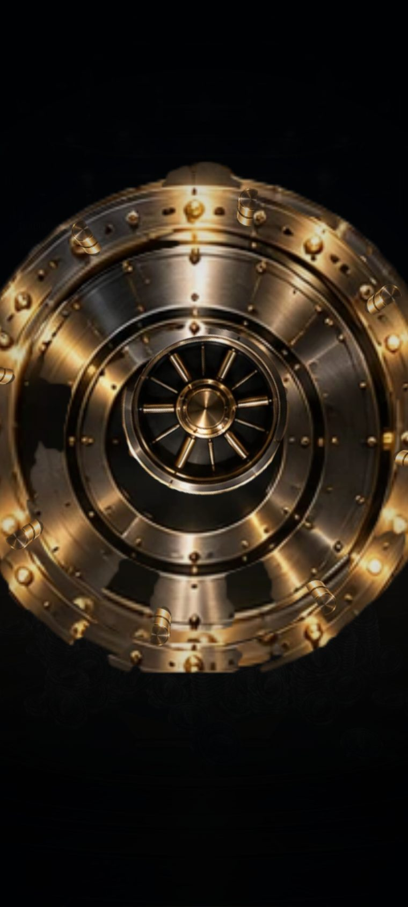

### Unlocking — the wheel turns, the bolts start to draw in

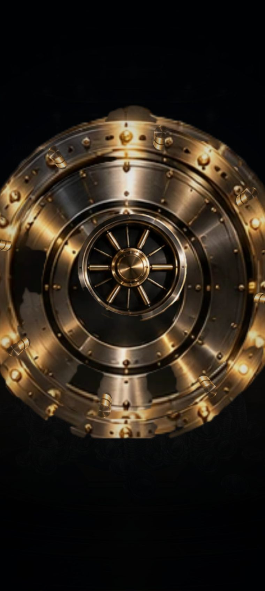

### The leaf pivots on its right edge and sweeps out

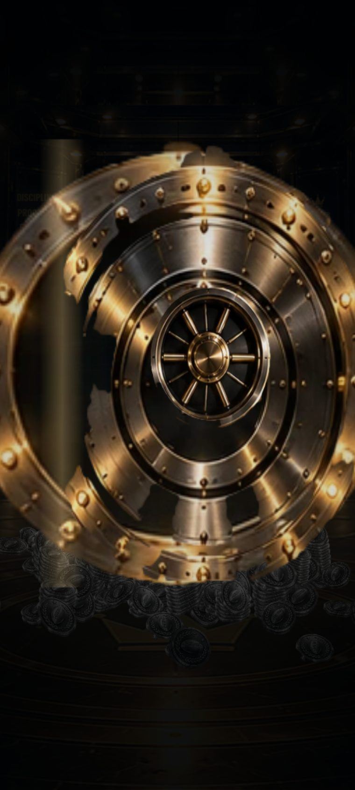

### The room arrives behind it

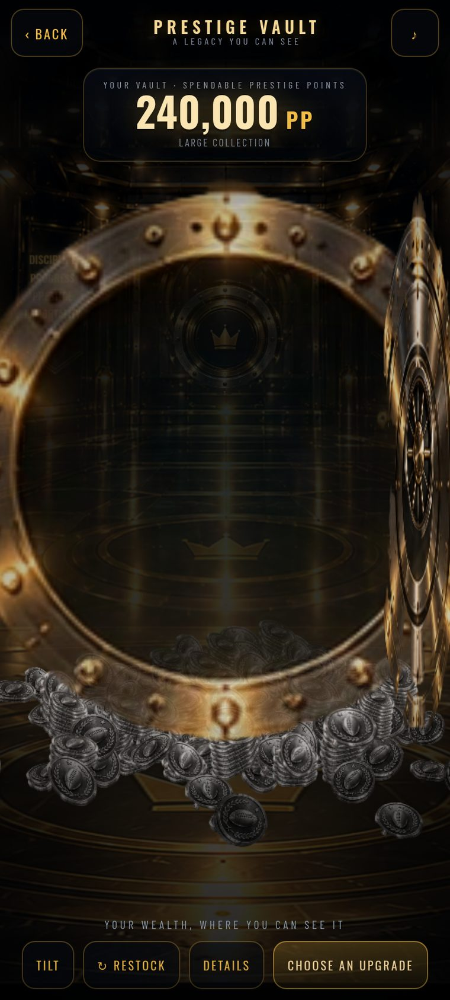

### Empty vault — 0 PP

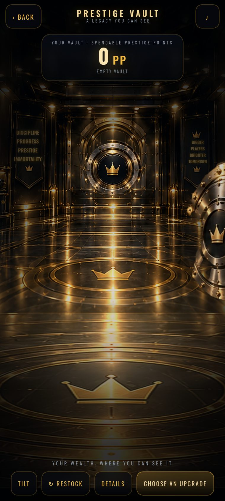

### Almost empty — 7 PP, and exactly seven coins

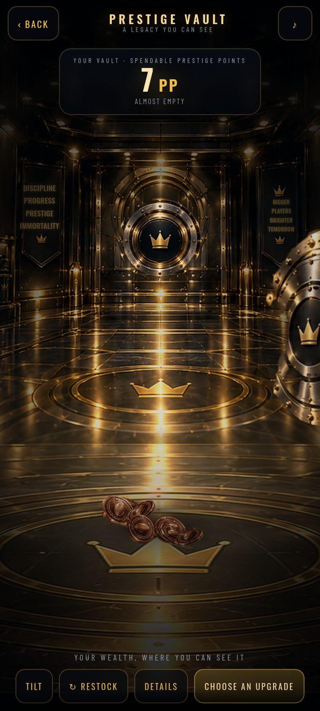

### Modest savings — 420 PP

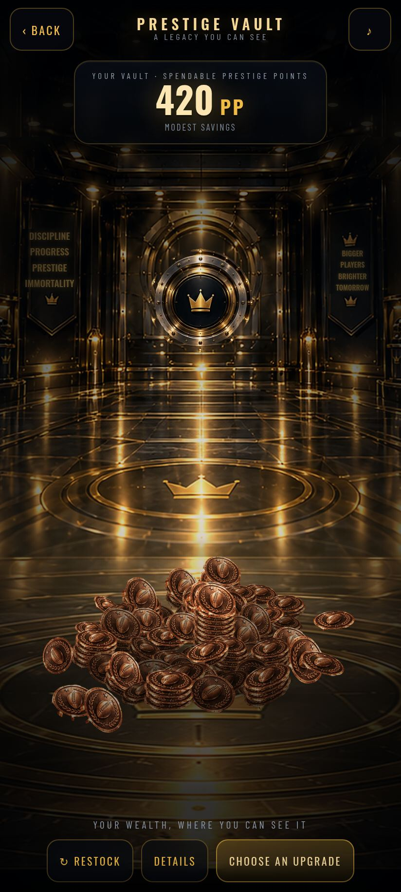

### Growing wealth — 7,500 PP, stacks appearing

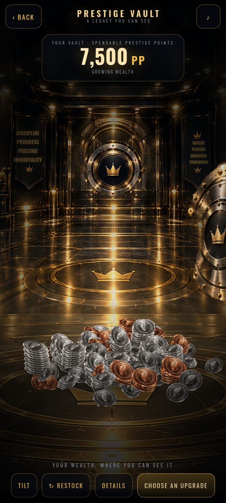

### Large collection — 90,000 PP

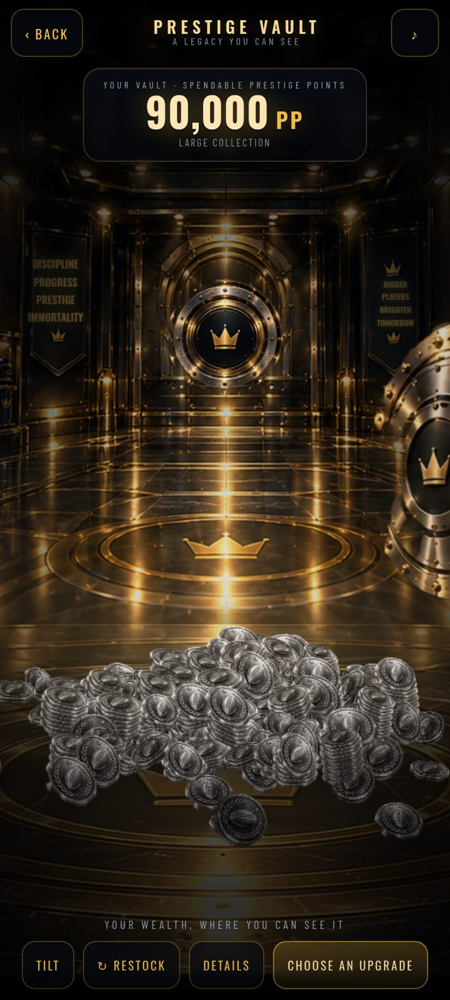

### Massive collection — 2,400,000 PP, gold and silver stacked

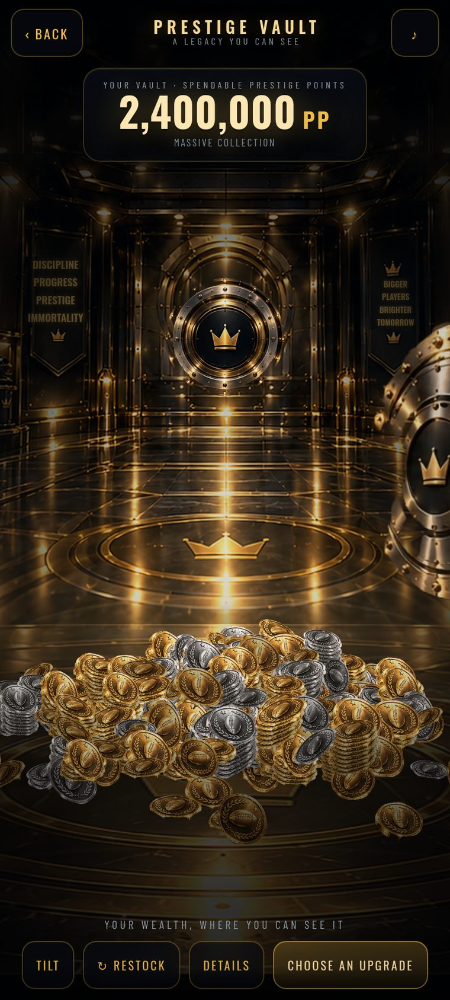

### Nearly full — 40,000,000 PP

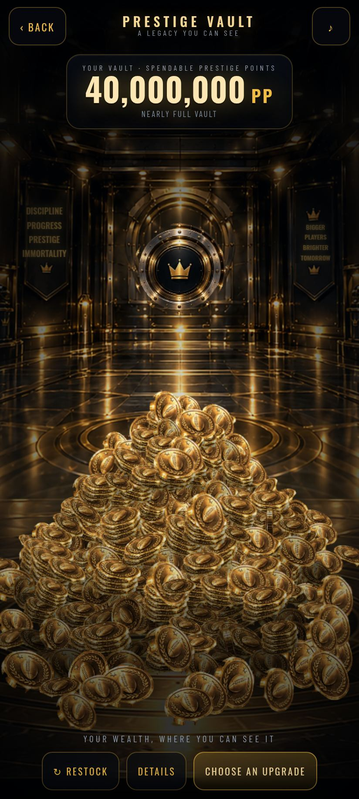

### Overflowing — 1.25B PP, all four faces, blue as a rare accent

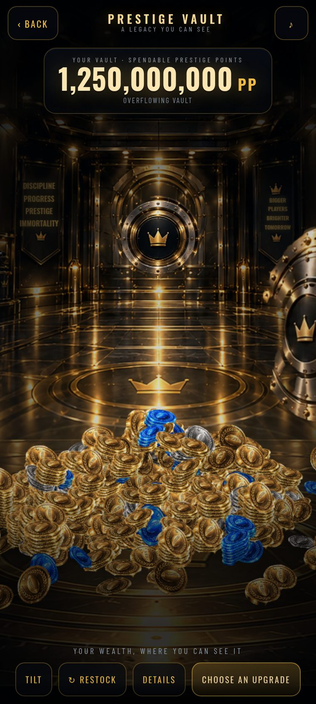

### Drag: a coin picked up off the heap, its shadow on the floor under it

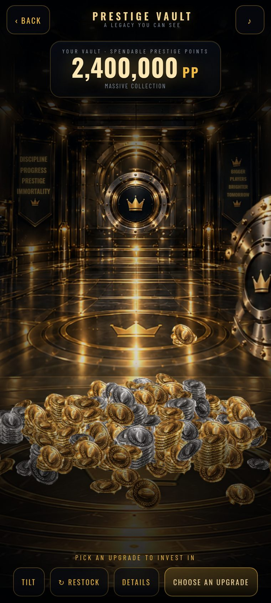

### Tilt: the phone tipped left, the towers topple and the money rolls to the low side

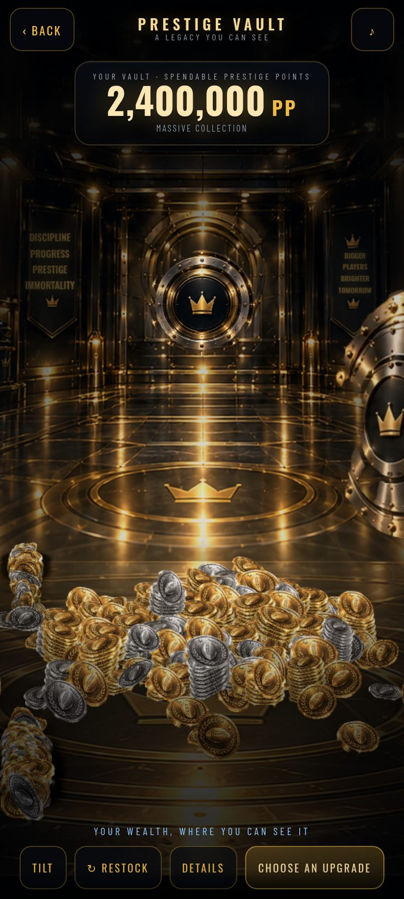

### RESTOCK: every disturbed coin back in its place

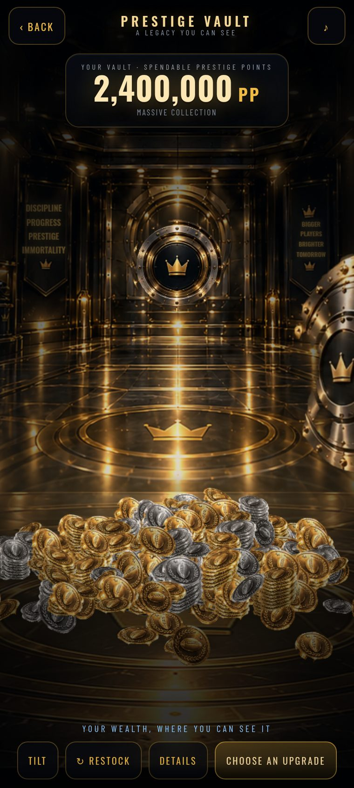

### Walked in from the tree with an upgrade selected

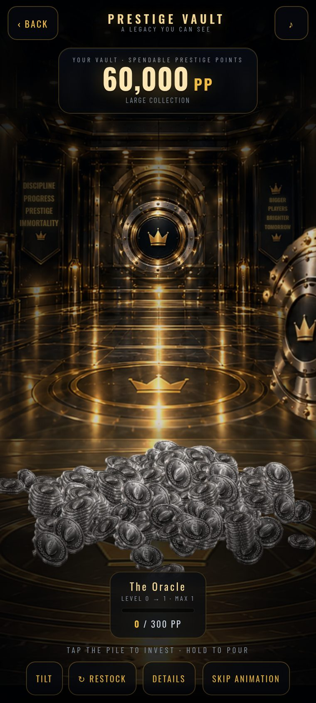

### The first tap: a coin detaches and leaves the pile

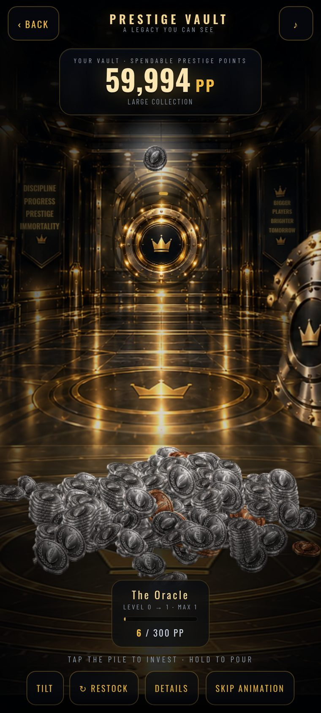

### Holding: the stream accelerating

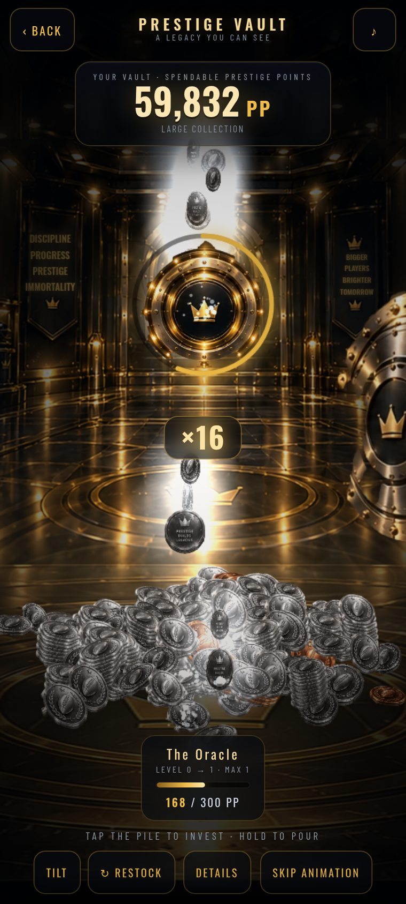

### 16x: the currency vortex, the core charging

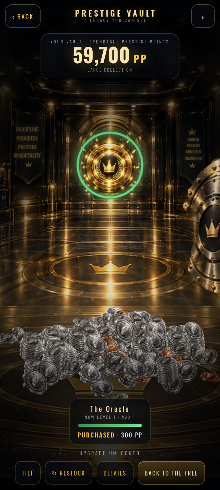

### Upgrade unlocked, the price debited exactly once

### A career settles: the money falls into the vault

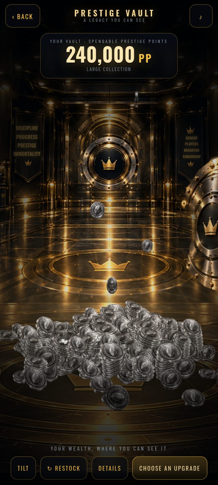

### Desktop / landscape

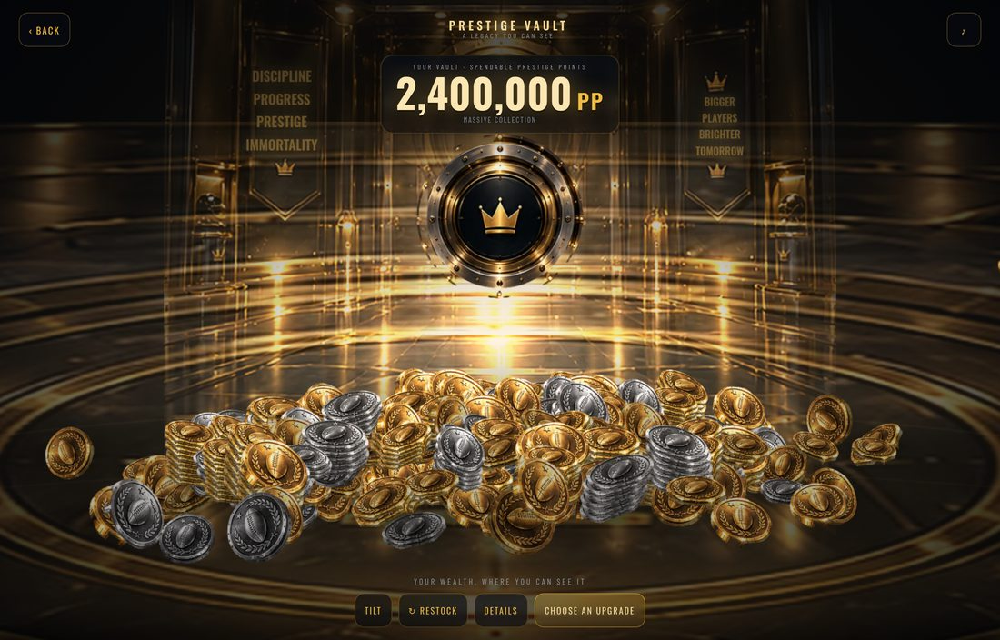
