# Prestige Vault — screenshots

Captured from the real game in headless Chromium at 412x915 (portrait, DPR 2) and
1280x820 (desktop), by `scripts/vaultshot.mjs`, `scripts/vaultspend.mjs` and
`scripts/vaultdoor.mjs`. Nothing here is a mockup.

### The vault shut: the leaf, the lock wheel, the bolts

### The leaf swinging out on its hinge, the room arriving

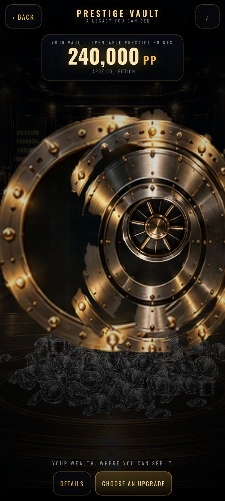

### Empty vault — 0 PP

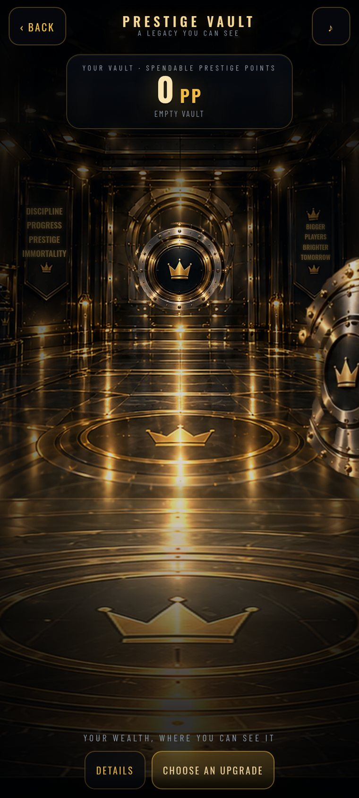

### Almost empty — 7 PP, seven bronze coins on the floor

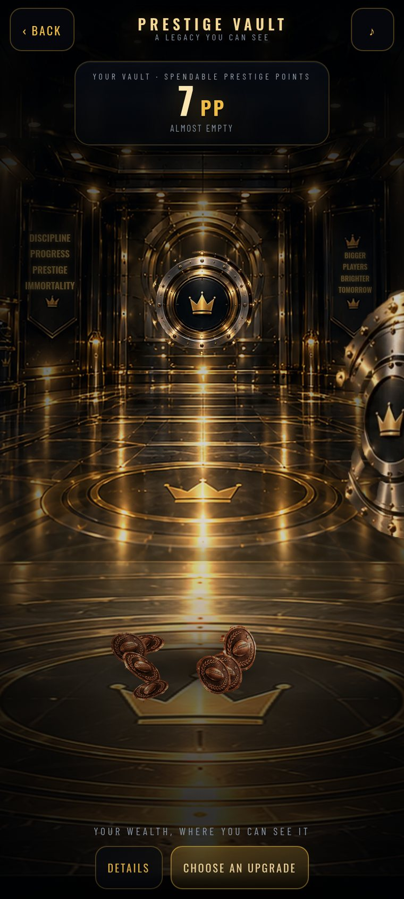

### Modest savings — 420 PP

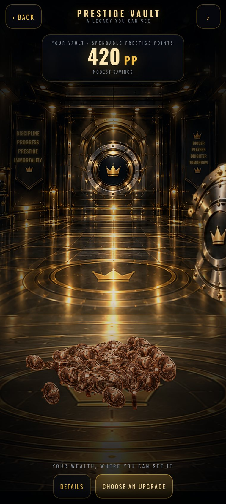

### Growing wealth — 7,500 PP

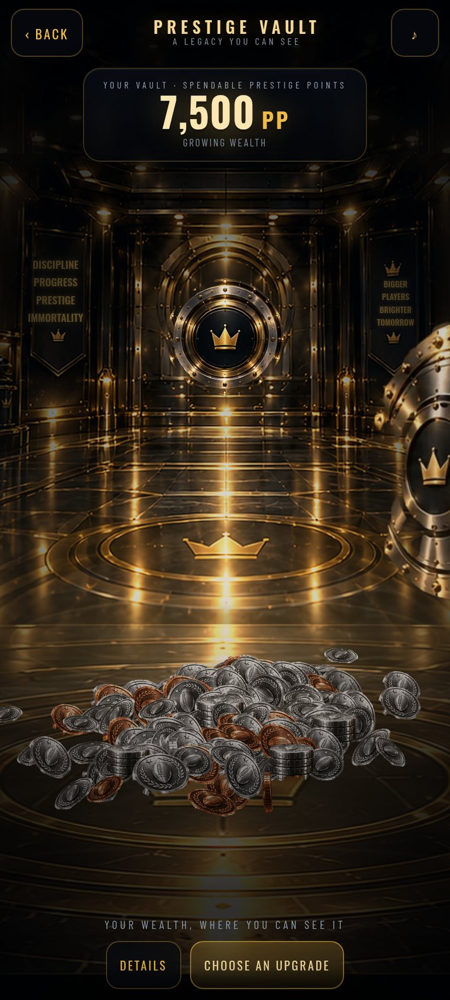

### Large collection — 90,000 PP

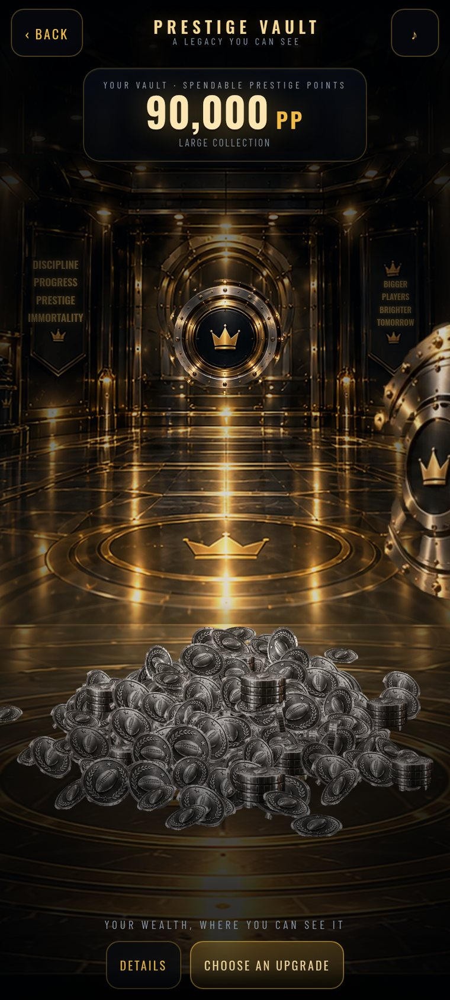

### Massive collection — 2,400,000 PP, gold and silver mixed

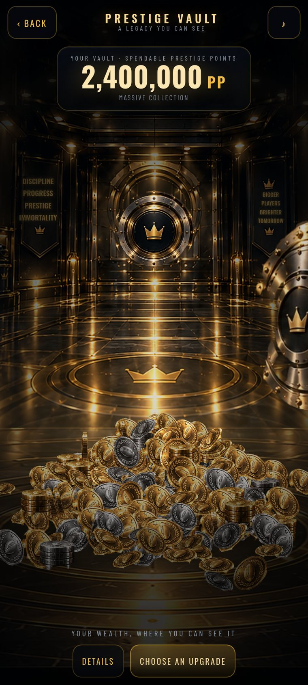

### Nearly full — 40,000,000 PP

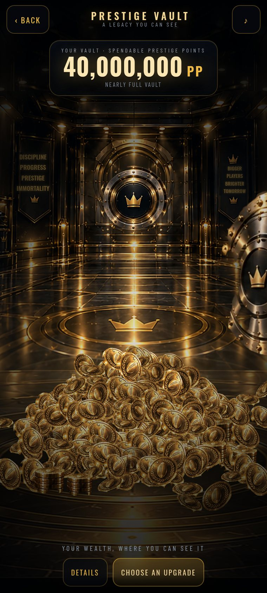

### Overflowing — 1.25B PP, all four faces, blue as a rare accent

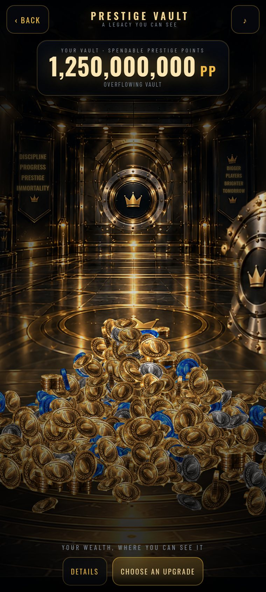

### Walked in from the tree with an upgrade selected

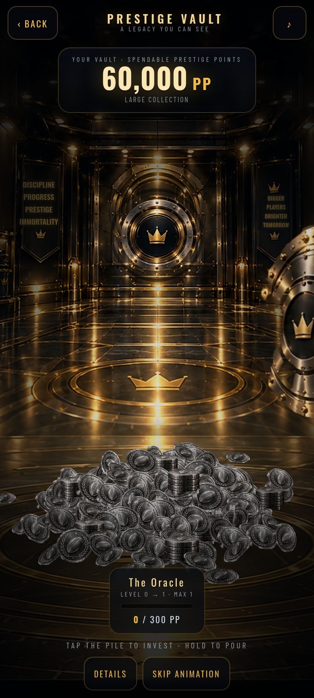

### The first tap: a coin detaches and leaves the pile

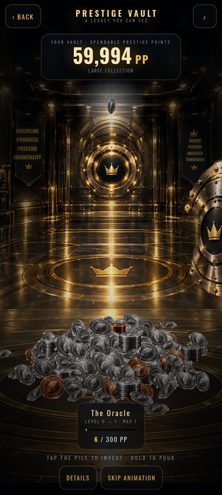

### Holding: the stream accelerating

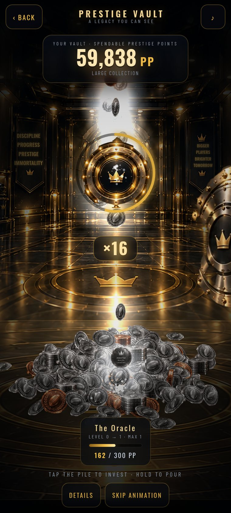

### 16x: the currency vortex, the core nearly charged

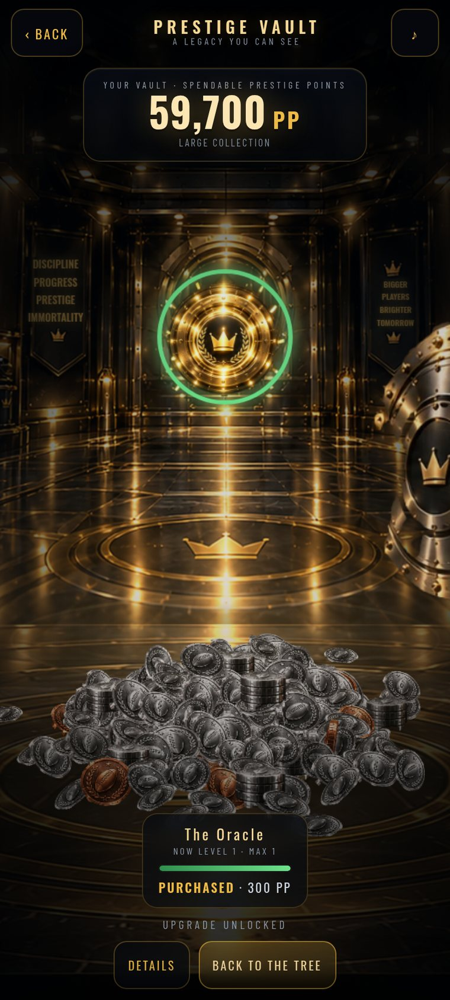

### Upgrade unlocked, the price debited exactly once

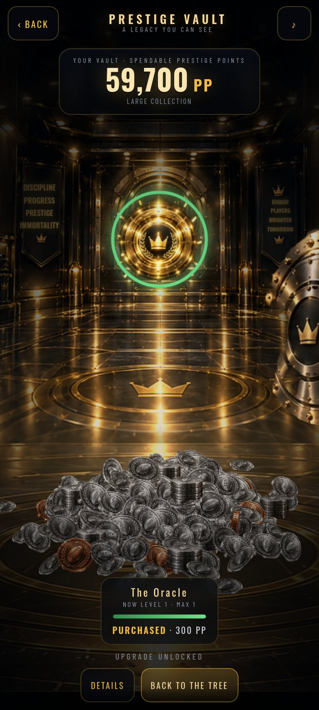

### A career settles: the money falls into the vault

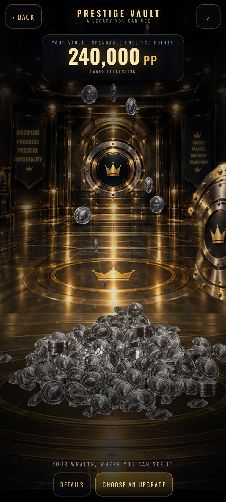

### Desktop / landscape

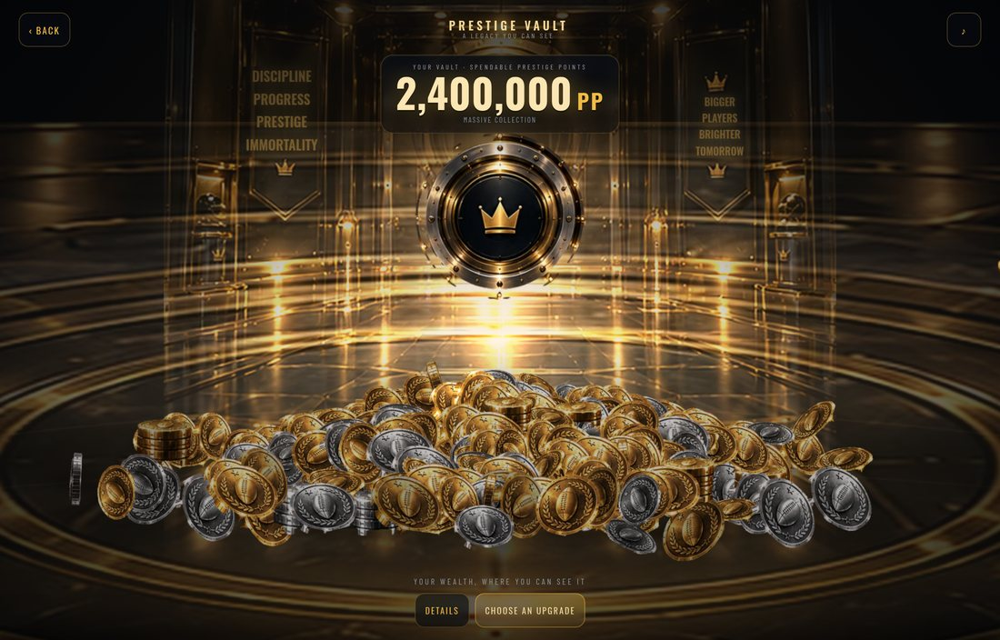
